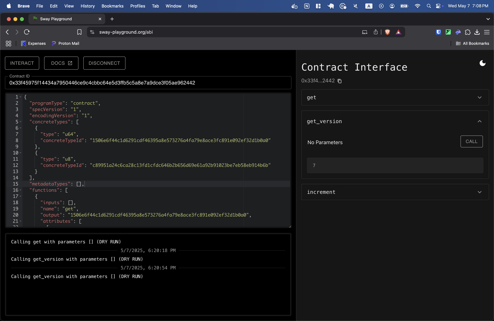
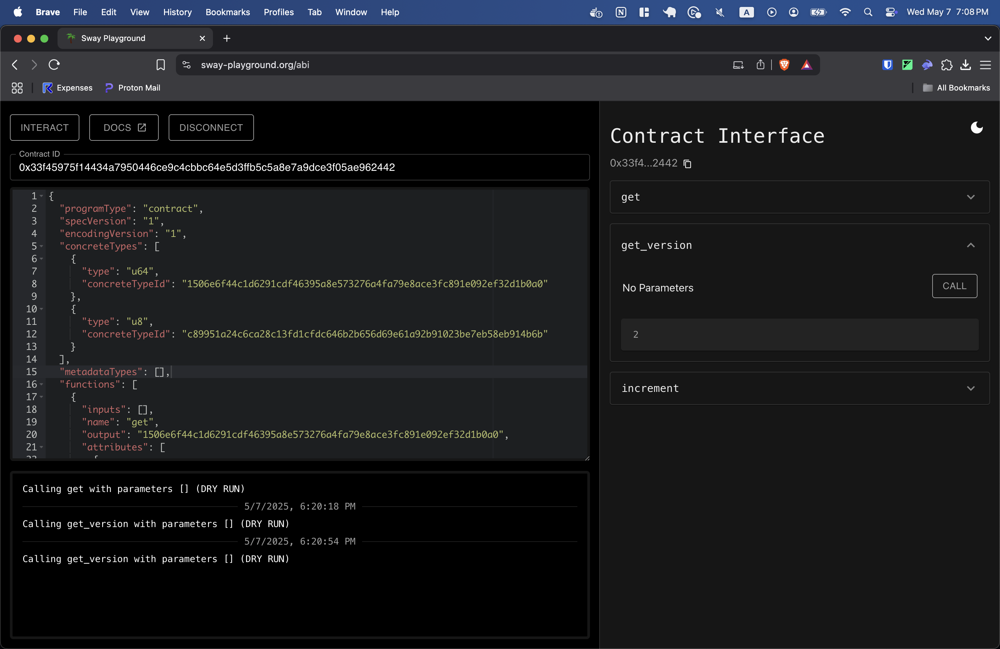

# sway-contract-upgrade-example
Simple example of how to upgrade contracts in Sway

1. Add proxy functionality to Forc.toml

```toml
[proxy]
enabled = true
```

2. Deploy the contract using `forc deploy`

```bash
forc deploy --mainnet
```

You will notice an address in your forc.toml under `[proxy]` file after the deployment, this is your proxy contract address.

```
[proxy]
enabled = true
address = "0x33f45975f14434a7950446ce9c4cbbc64e5d3ffb5c5a8e7a9dce3f05ae962442"
```

4. Go to [Sway-Playground](https://www.sway-playground.org/abi) and paste the abi in `out/debug/sway-contract-upgrade-example-abi.json` as well as the address to interact with `get_version` function and verify that the number is 7.



3. Change line 3 in `src/main.sw` to a new number 

```rust
const VERSION: u8 = 7u8;
```

4. Redeploy the contract using `forc deploy` again 

```bash
forc deploy --mainnet
```

5. Go back to [Sway-Playground](https://www.sway-playground.org/abi) and verify that the number is now your new number.



6. Congratulations! You just upgraded your first contract in Sway!


